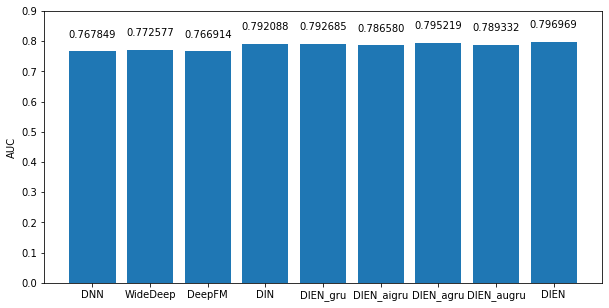

<<<<<<< HEAD
# CTR model
* This project implements common typical Click-Through-Rate(CTR) model in recommender system by pytorch.

## Note
* This project refers to the code **prediction-flow**

https://github.com/GitHub-HongweiZhang/prediction-flow

## how to use
* enter ./example to run the model in different datasets.

## feature
### how to define feature
There are two parameters for all feature types, name and column_flow.
The name parameter is used to index the column raw data from input data frame.
The column_flow parameter is a single transformer of a list of transformers.
The transformer is used to pre-process the column data before training the model.

* dense number feature
```
Number('age', StandardScaler())
Number('ctr', None)
```
* sparse category feature
```
Category('movieId', CategoryEncoder(min_cnt=1))
```
* var length sequence feature
```
Sequence('genres', SequenceEncoder(sep='|', min_cnt=1))
```

## transformer
The following transformers are provided now.

| transformer | supported feature type | detail |
|--|--|--|
| StandardScaler | Number | Wrapper of scikit-learn's StandardScaler. Null value must be filled in advance. |
| LogTransformer | Number | Log scaler. Null value must be filled in advance. |
| CategoryEncoder | Category | Converting str value to int. Null value must be filled in advance using '\_\_UNKNOWN\_\_'. |
| SequenceEncoder | Sequence | Converting sequence str value to int. Null value must be filled in advance using '\_\_UNKNOWN\_\_'. |

## model

| model | reference |
|--|--|
| DNN | - |
| Wide & Deep | [DLRS 2016][Wide & Deep Learning for Recommender Systems](https://arxiv.org/pdf/1606.07792.pdf) |
| DeepFM | [IJCAI 2017][DeepFM: A Factorization-Machine based Neural Network for CTR Prediction](http://www.ijcai.org/proceedings/2017/0239.pdf) |
| DIN | [KDD 2018][Deep Interest Network for Click-Through Rate Prediction](https://arxiv.org/pdf/1706.06978.pdf) |
| DNN + GRU + GRU + Attention | [AAAI 2019][Deep Interest Evolution Network for Click-Through Rate Prediction](https://arxiv.org/pdf/1809.03672.pdf) |
| DNN + GRU + AIGRU | [AAAI 2019][Deep Interest Evolution Network for Click-Through Rate Prediction](https://arxiv.org/pdf/1809.03672.pdf) |
| DNN + GRU + AGRU | [AAAI 2019][Deep Interest Evolution Network for Click-Through Rate Prediction](https://arxiv.org/pdf/1809.03672.pdf) |
| DNN + GRU + AUGRU | [AAAI 2019][Deep Interest Evolution Network for Click-Through Rate Prediction](https://arxiv.org/pdf/1809.03672.pdf) |
| DIEN | [AAAI 2019][Deep Interest Evolution Network for Click-Through Rate Prediction](https://arxiv.org/pdf/1809.03672.pdf) |
| OTHER | TODO |

## example
### movielens-1M 
**This dataset is just used to test the code can run, accuracy does not make
sense.**
* Prepare the dataset. [preprocess.ipynb](examples/movielens/ml-1m/preprocess.ipynb)
* Run the model. [movielens-1m.ipynb](examples/movielens/movielens-1m.ipynb)

### amazon_e
* This dataset is an amazon product dataset of electronics category, which has 498,196 products and 7,824,482 records. We refers to DIEN code to precess this dataset
https://github.com/zhougr1993/DeepInterestNetwork

### amazon
* Prepare the dataset. [prepare_neg.ipynb](examples/amazon/prepare_neg.ipynb)
* Run the model.
  [amazon.ipynb](examples/amazon/amazon.ipynb)
* An example using [pytorch-lightning](https://github.com/williamFalcon/pytorch-lightning).
  [amazon-lightning.ipynb](examples/amazon/amazon-lightning.ipynb)

**accuracy**



## acknowledge and reference
* Referring the design from [DeepCTR](https://github.com/shenweichen/DeepCTR),
  the features are divided into dense (class Number), sparse (class Category),
  sequence (class Sequence) types.
=======
# CTRmodel_pytorch
>>>>>>> d6302eeabc43a891e759a35a1755a4894d379b23
